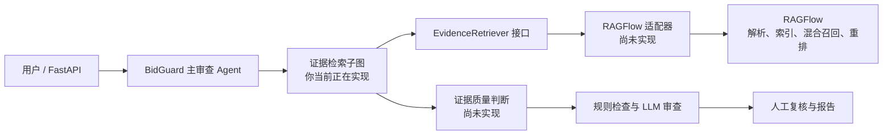

```mermaid
flowchart LR
    U["用户 / FastAPI"] --> M["BidGuard 主审查 Agent"]
    M --> R["证据检索子图<br/>你当前正在实现"]
    R --> P["EvidenceRetriever 接口"]
    P --> A["RAGFlow 适配器<br/>尚未实现"]
    A --> F["RAGFlow<br/>解析、索引、混合召回、重排"]

    R --> G["证据质量判断<br/>尚未实现"]
    G --> J["规则检查与 LLM 审查"]
    J --> H["人工复核与报告"]
```
